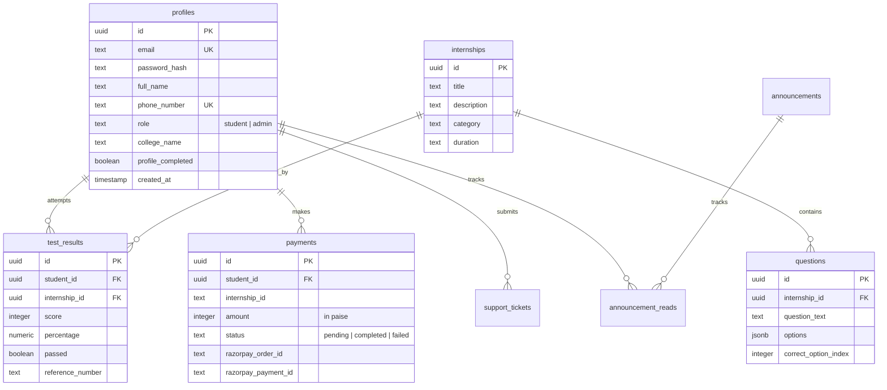

# IQ Intern - Project Brain & Feature Map

Welcome to the **IQ Intern** project map. This document serves as the developer's guide to the repository structure, code locations, database design, and key architectural elements.

---

## 🛠️ Technology Stack

- **Core Framework**: [Next.js 16 (App Router)](file:///c:/Users/shiwa/OneDrive/Documents/GitHub/skillintern/package.json#L24) & [React 19](file:///c:/Users/shiwa/OneDrive/Documents/GitHub/skillintern/package.json#L29)
- **Styling**: [Tailwind CSS v4](file:///c:/Users/shiwa/OneDrive/Documents/GitHub/skillintern/package.json#L46) with custom UI layout tokens, [Globals CSS](file:///c:/Users/shiwa/OneDrive/Documents/GitHub/skillintern/app/globals.css)
- **Database & Auth**: [Supabase](file:///c:/Users/shiwa/OneDrive/Documents/GitHub/skillintern/lib/supabase) (Client/Admin client, SSR sessions, and custom SHA-256 salted credentials flow)
- **PDF Generation**: [Puppeteer & Chromium](file:///c:/Users/shiwa/OneDrive/Documents/GitHub/skillintern/package.json#L26-L27) rendering customized HTML templates
- **Email Despatch**: [Nodemailer](file:///c:/Users/shiwa/OneDrive/Documents/GitHub/skillintern/package.json#L25) with inline HTML layout templates
- **Interactive UI Components**: [Framer Motion](file:///c:/Users/shiwa/OneDrive/Documents/GitHub/skillintern/package.json#L20) (animations), [Lucide React](file:///c:/Users/shiwa/OneDrive/Documents/GitHub/skillintern/package.json#L23) (icons), and [Recharts](file:///c:/Users/shiwa/OneDrive/Documents/GitHub/skillintern/package.json#L32) (data dashboard charts)
- **Payment Gateway**: [Razorpay](file:///c:/Users/shiwa/OneDrive/Documents/GitHub/skillintern/package.json#L28) SDK wrapper

---

## 📂 Codebase Architecture & Feature Index

Below is the directory map detailing what every major module does and where its logic is written.

### 1. Custom Authentication & Session Cache
Handles profile creation, secure login, password resets, and session management using local caching and client-side cookie helpers.
- **Login / Register Frontend**: [app/auth/login](file:///c:/Users/shiwa/OneDrive/Documents/GitHub/skillintern/app/auth/login) / [app/auth/register](file:///c:/Users/shiwa/OneDrive/Documents/GitHub/skillintern/app/auth/register)
- **Forgot Password**: [app/auth/forgot-password](file:///c:/Users/shiwa/OneDrive/Documents/GitHub/skillintern/app/auth/forgot-password)
- **Email/Phone Verification Callback**: [app/auth/callback](file:///c:/Users/shiwa/OneDrive/Documents/GitHub/skillintern/app/auth/callback)
- **Client Session Manager**: [lib/supabase/auth.ts](file:///c:/Users/shiwa/OneDrive/Documents/GitHub/skillintern/lib/supabase/auth.ts) (manages cookie parsing and `sessionStorage` TTL caching)
- **Server Verification API**: [lib/supabase/server-auth.ts](file:///c:/Users/shiwa/OneDrive/Documents/GitHub/skillintern/lib/supabase/server-auth.ts) (verifies salted SHA-256 hashes against PostgreSQL `profiles`)

### 2. Student Workspace (`/student`)
The dashboard and suite of pages dedicated to enrolled students.
- **Home Dashboard**: [app/student/dashboard/page.tsx](file:///c:/Users/shiwa/OneDrive/Documents/GitHub/skillintern/app/student/dashboard/page.tsx) — Displays announcements, track progress, document generation states, and links to support.
- **Profile Completion**: [app/student/complete-profile/page.tsx](file:///c:/Users/shiwa/OneDrive/Documents/GitHub/skillintern/app/student/complete-profile/page.tsx) — Multi-step verification form (personal details, institution details, address).
- **Internship Selection**: [app/student/internships/page.tsx](file:///c:/Users/shiwa/OneDrive/Documents/GitHub/skillintern/app/student/internships/page.tsx) — Catalog of available tracks and enrollment gateway.
- **Payment Processing**: [app/student/payment/page.tsx](file:///c:/Users/shiwa/OneDrive/Documents/GitHub/skillintern/app/student/payment/page.tsx) — Integrates the frontend Razorpay modal.
- **MCQ Assessment Engine**:
  - Curriculum pre-test details: [app/student/assessments/page.tsx](file:///c:/Users/shiwa/OneDrive/Documents/GitHub/skillintern/app/student/assessments/page.tsx)
  - Timed 5-minute MCQ exam interface: [app/student/test/page.tsx](file:///c:/Users/shiwa/OneDrive/Documents/GitHub/skillintern/app/student/test/page.tsx)
  - Result scorecards and feedback: [app/student/results/page.tsx](file:///c:/Users/shiwa/OneDrive/Documents/GitHub/skillintern/app/student/results/page.tsx)
- **Documents & Project Guides**: [app/student/documents/page.tsx](file:///c:/Users/shiwa/OneDrive/Documents/GitHub/skillintern/app/student/documents/page.tsx) — Offers downloadable task guidelines, templates, and project submission guides.
- **Verification Portal**: [app/student/certificates/page.tsx](file:///c:/Users/shiwa/OneDrive/Documents/GitHub/skillintern/app/student/certificates/page.tsx) — Shows students their successfully cleared tracks.

### 3. Administrator Console (`/admin`)
The platform control panel for system administration.
- **Main Metrics Dashboard**: [app/admin/dashboard/page.tsx](file:///c:/Users/shiwa/OneDrive/Documents/GitHub/skillintern/app/admin/dashboard/page.tsx) — Displays counters for active learners, transactions, ticket stats, and charts.
- **Colleges & Partnerships**: [app/admin/colleges/page.tsx](file:///c:/Users/shiwa/OneDrive/Documents/GitHub/skillintern/app/admin/colleges/page.tsx) — Manages institutional roll-ups and partner metrics.
- **Internship Catalog Editor**: [app/admin/internships/page.tsx](file:///c:/Users/shiwa/OneDrive/Documents/GitHub/skillintern/app/admin/internships/page.tsx) — Configures durations, descriptions, and prerequisites.
- **Student Profile Manager**: [app/admin/students/page.tsx](file:///c:/Users/shiwa/OneDrive/Documents/GitHub/skillintern/app/admin/students/page.tsx) — Searchable list of all student registrations and verification audits.
- **Payment Approvals**: [app/admin/payments/page.tsx](file:///c:/Users/shiwa/OneDrive/Documents/GitHub/skillintern/app/admin/payments/page.tsx) — Audits Razorpay logs and manually updates statuses.
- **Question Bank Creator**: [app/admin/questions/page.tsx](file:///c:/Users/shiwa/OneDrive/Documents/GitHub/skillintern/app/admin/questions/page.tsx) — Manages assessment MCQs mapped to internships.
- **Support Desk**: [app/admin/support/page.tsx](file:///c:/Users/shiwa/OneDrive/Documents/GitHub/skillintern/app/admin/support/page.tsx) — Lists student support tickets, answers queries, and flags status updates.
- **Announcement Dispatcher**: [app/admin/announcements/page.tsx](file:///c:/Users/shiwa/OneDrive/Documents/GitHub/skillintern/app/admin/announcements/page.tsx) — Publishes high, medium, and low-priority alerts.
- **Document Template Builder**: [app/admin/templates/page.tsx](file:///c:/Users/shiwa/OneDrive/Documents/GitHub/skillintern/app/admin/templates/page.tsx) — Edit custom HTML layouts for receipts, certificates, and letters dynamically.
- **System Settings**: [app/admin/settings/page.tsx](file:///c:/Users/shiwa/OneDrive/Documents/GitHub/skillintern/app/admin/settings/page.tsx) — Manages global keys and parameters.

### 4. API Core Endpoints
- **Razorpay Order Creation**: [app/api/create-order/route.ts](file:///c:/Users/shiwa/OneDrive/Documents/GitHub/skillintern/app/api/create-order/route.ts)
- **Signature Verification**: [app/api/verify-payment/route.ts](file:///c:/Users/shiwa/OneDrive/Documents/GitHub/skillintern/app/api/verify-payment/route.ts)
- **Track Selection Routing**: [app/api/select-internship/route.ts](file:///c:/Users/shiwa/OneDrive/Documents/GitHub/skillintern/app/api/select-internship/route.ts)
- **Document Download Engine**: [app/api/documents/route.ts](file:///c:/Users/shiwa/OneDrive/Documents/GitHub/skillintern/app/api/documents/route.ts)

### 5. Document & HTML Layout Engine
Generates dynamic academic documents, receipts, letters, and certificates.
- **Document Dispatcher & Cache**: [lib/documents/generator.ts](file:///c:/Users/shiwa/OneDrive/Documents/GitHub/skillintern/lib/documents/generator.ts) — Integrates Puppeteer/Chromium, loads templates, maps placeholder variables, and caches PDFs.
- **Attendance Generator**: [lib/documents/attendance-engine.ts](file:///c:/Users/shiwa/OneDrive/Documents/GitHub/skillintern/lib/documents/attendance-engine.ts) — Simulates structured daily logs and marks.
- **Template Loader**: [lib/templates/template-loader.ts](file:///c:/Users/shiwa/OneDrive/Documents/GitHub/skillintern/lib/templates/template-loader.ts)
- **Template Placeholder Substitution**: [lib/templates/template-renderer.ts](file:///c:/Users/shiwa/OneDrive/Documents/GitHub/skillintern/lib/templates/template-renderer.ts)
- **Default Document Layout Templates**:
  - Payment Receipt HTML: [public/templates/default/receipt.html](file:///c:/Users/shiwa/OneDrive/Documents/GitHub/skillintern/public/templates/default/receipt.html)
  - Certificates: [public/templates/default/certificate.html](file:///c:/Users/shiwa/OneDrive/Documents/GitHub/skillintern/public/templates/default/certificate.html)
  - Offer Letters: [public/templates/default/offer_letter.html](file:///c:/Users/shiwa/OneDrive/Documents/GitHub/skillintern/public/templates/default/offer_letter.html)

---

## 🗄️ Database Schema & Storage Map

Definitions are maintained in the [schema.sql](file:///c:/Users/shiwa/OneDrive/Documents/GitHub/skillintern/schema.sql) file. The core relationships are structured as follows:

---

## ⚙️ Maintenance & Development Utilities

- **Caching Directory**: Documents are cached under `pdf_cache/` at the root folder during local dev.
- **Cleanup and Development**:
  - `npm run dev`: Cleans the local document cache and fires up Next.js.
  - `npm run build`: Cleans cache and executes a production build.
- **Development Scripts** ([scripts/](file:///c:/Users/shiwa/OneDrive/Documents/GitHub/skillintern/scripts)):
  - [scripts/clean-cache.js](file:///c:/Users/shiwa/OneDrive/Documents/GitHub/skillintern/scripts/clean-cache.js): Safely flushes the pdf_cache dir.
  - [scripts/create_templates.js](file:///c:/Users/shiwa/OneDrive/Documents/GitHub/skillintern/scripts/create_templates.js): Pre-populates document layout structures.
  - [scripts/sync-templates-db.js](file:///c:/Users/shiwa/OneDrive/Documents/GitHub/skillintern/scripts/sync-templates-db.js): Synchronizes local templates to the database.

---

## ⚠️ Important Developer Guidelines

1. **Next.js Conventions**: This project uses Next.js 16. Ensure you adhere to its specific folder conventions and SSR configs. Read `node_modules/next/dist/docs/` before making key router modifications.
2. **Auto-updating brain.md**: Whenever adding a new feature, directory, or updating a core business module, immediately add it to this file (`brain.md`) to maintain accurate workspace mapping.
3. **Database schema migrations**: All custom SQL table changes must be documented in [schema.sql](file:///c:/Users/shiwa/OneDrive/Documents/GitHub/skillintern/schema.sql).
